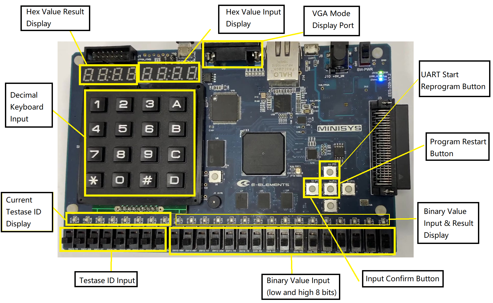

# SUSTech_CS202-Organization_2023s_Project-CPU
Single Cycle CPU: Our Project of CS202 2023 Spring: Computer Organization, SUSTech.

We use [FPGA MINISYS 1-A](http://www.e-elements.com/product/show/id/1.shtml) to implement part of the [MIPS instruction set](https://mips.com/). Support simple bit operation and binary addition, subtraction, multiplication, and division functions.

Final socre: 121/100.

### Project Information

You can check [docs folder](docs/) to see project requirement. And our project report in Chinese.

### Repo Structure

```
├─ASM_Minisys-1A
├─CPU_Verilog
├─docs
├─EDA_Xilinx
└─unused
```

- **ASM_Minisys-1A** : MIPS assembly file and binary file ,check `Readme` in this folder for more information.
- **CPU_Verilog** : Verilog file for this project.
- **docs** : Project requirement and our report.
- **EDA_Xilinx** : Some files for Xilinx EDA Vivado, check `Readme` in this folder for more information.
- **unused** : Some unused files, including [Verilog file for onlinejudge test](unused/OJ_backup/).

### Quick Start

Use [Vivado](https://www.xilinx.com/products/design-tools/vivado.html), select the device `xc7a100tfgg484-1`.

You can load [bitstream file](EDA_Xilinx/CPU_TOP_new.bit) directly, or:

1. Add the IP core in [`EDA_Xilinx/`](EDA_Xilinx/)
2. The RAM and ROM IP core loads the .coe file in [`EDA_Xilinx/`](EDA_Xilinx/) respectively
3. Add the Verilog file in [`CPU_Verilog/`](CPU_Verilog/)
4. Add the [pin constraint file](EDA_Xilinx/minisys_cons.xdc)
5. Use VIvado to simulate, synthesize, and then generate bitstream files

### Board information



For example, if you want to do scene 1 test case `001`:

1. Press Program Restart Button
2. Press UART Start Reprogram Button, then use UART to transmit [`sc1_new_version.txt`](ASM_Minisys-1A/uart_txt/sc1_new_version.txt)
3. Press Program Restart Button again to start the new program
4. Let "Testcase ID Input" low 3 bits switch be `001` (`1` means on), then press Input confirm button
5. Let Binary Value Input low 8 bits be the number 1 you want to input, then press Input confirm button, the Binary Value Input display will show the number 1 in high 8 bits.
6. Let Binary Value Input low 8 bits be the number 2 you want to input, then press Input confirm button, the Binary Value Input display will show the number 2 in low 8 bits.
7. Press Input confirm button, then the led or keyboard will show the result.
