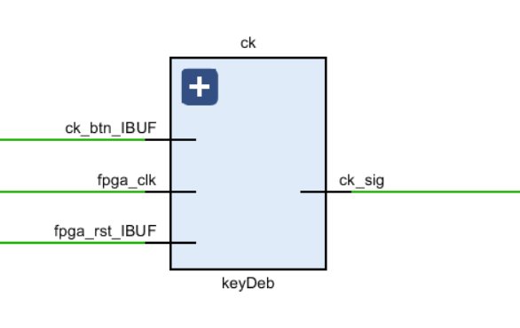

## SUSTech_CS202-Organization_2023s_Project-CPU

#### 小组成员：徐春晖，郭健阳，唐培致

> 源码托管于 GitHub，将在项目 ddl 结束后基于 **MIT License** 协议开源，访问链接：
>
> https://github.com/OctCarp/SUSTech_CS202-Organization_2023s_Project-CPU

------

### 开发者说明

| 姓名       | 学号         | 负责内容                                                     | 贡献比 |
| ---------- | ------------ | ------------------------------------------------------------ | ------ |
| **徐春晖** | **12110304** | CPU 硬件的实现和测试，场景 1 汇编编写，VGA 模式输出，文档写作，视频拍摄 |        |
| **郭健阳** | **12111506** | 场景 2 汇编编写，汇编代码测试，文档写作，视频剪辑            |        |
| **唐培致** | **12110502** | 键盘输入，七段数码显示管输出，文档写作，视频拍摄             |        |

### 版本修改记录

主要几个版本迭代：

- OJ 基本通过版本：05/13
- 测试场景 1 汇编及通过， UART 可用：05/14
- 同老师交流后修改部分时序逻辑的时钟错误：05/15
- 测试场景 2 通过：05/17
- 键盘输入和七段数码显示管功能：05/21
- VGA 功能及最终答辩版本：05/22

具体细节还可参考 GitHub 仓库提交记录。

------

### CPU 架构设计说明

#### 1. CPU特性：

- **ISA**：

| R-Type | opcode   | rs    | rt    | rd    | shamt | func   | 使用方式                             | 举例            |
| ------ | -------- | ----- | ----- | ----- | ----- | ------ | ------------------------------------ | --------------- |
| add  | `000000` | rs    | rt    | rd    | `00000` | `100000` | rd <- **rs + rt**                    | `add $1, $2, $3` |
| addu   | `000000` | rs    | rt    | rd    | `00000` | `100001` | rd <- **rs + rt (无符号)**           | `addu $1, $2, $3` |
| sub    | `000000` | rs    | rt    | rd    | `00000` | `100010` | rd <- **rs - rt**                    | `sub $1, $2, $3` |
| subu   | `000000` | rs    | rt    | rd    | `00000` | `100011` | rd <- **rs - rt (无符号)**           | `subu $1, $2, $3` |
| and    | `000000` | rs    | rt    | rd    | `00000` | `100100` | rd <- **rs & rt**                    | `and $1, $2, $3` |
| or     | `000000` | rs    | rt    | rd    | `00000` | `100101` | rd <- **rs \| rt**                   | `or $1, $2, $3` |
| xor    | `000000` | rs    | rt    | rd    | `00000` | `100110` | rd <- **rs ^ rt**                    | `xor $1, $2, $3` |
| nor    | `000000` | rs    | rt    | rd    | `00000` | `100111` | rd <- **~(rs \| rt)**                | `nor $1, $2, $3` |
| slt    | `000000` | rs    | rt    | rd    | `00000` | `101010` | rd <- **(rs < rt) ? 1 : 0**          | `slt $1, $2, $3` |
| sltu   | `000000` | rs    | rt    | rd    | `00000` | `101011` | rd <- **(rs < rt) ? 1 : 0 (无符号)** | `sltu $1, $2, $3` |
| sll    | `000000` | `00000` | rt    | rd    | shamt | `000000` | rd <- **rt << shamt**                | `sll $1, $2, 4` |
| srl    | `000000` | `00000` | rt    | rd    | shamt | `000010` | rd <- **rt >> shamt (逻辑右移)**     | `srl $1, $2, 4` |
| sra    | `000000` | `00000` | rt    | rd    | shamt | `000011` | rd <- **rt >> shamt (算术右移)**     | `sra $1, $2, 4` |
| jr     | `000000` | rs    | `00000` | `00000` | `00000` | `001000` | 跳转到目标寄存器中存的地址 |`jr $ra`|

| I-Type | opcode   | rs      | rt      | immediate | 使用方式                                                | 举例                |
| ------ | -------- | ------- | ------- | --------- | ------------------------------------------------------- | ------------------- |
| addi   | `001000` | rs      | rt      | immediate | rt <- **rs + immediate**                                | `addi $1, $2, 100`  |
| addiu  | `001001` | rs      | rt      | immediate | rt <- **rs + immediate (无符号)**                       | `addiu $1, $2, 100` |
| slti   | `001010` | rs      | rt      | immediate | rt <- **(rs < immediate) ? 1 : 0**                      | `slti $1, $2, 10`   |
| sltiu  | `001011` | rs      | rt      | immediate | rt <- **(rs < immediate) ? 1 : 0 (无符号)**             | `sltiu $1, $2, 10`  |
| andi   | `001100` | rs      | rt      | immediate | rt <- **rs & immediate**                                | `andi $1, $2, 255`  |
| ori    | `001101` | rs      | rt      | immediate | rt <- **rs \| immediate**                               | `ori $1, $2, 255`   |
| xori   | `001110` | rs      | rt      | immediate | rt <- **rs ^ immediate**                                | `xori $1, $2, 255`  |
| lui    | `001111` | `00000` | rt      | immediate | rt <- **immediate << 16**                               | `lui $1, 65535`     |
| lw     | `100011` | rs      | rt      | immediate | rt <- **Memory[rs + immediate]**                        | `lw $1, 100($2)`    |
| sw     | `101011` | rs      | rt      | immediate | Memory[rs + immediate] <- **rt**                        | `sw $1, 100($2)`    |
| beq    | `000100` | rs      | rt      | immediate | if rs = rt then branch to **PC + 4 + (immediate << 2)** | `beq $1, $2, label` |
| bne    | `000101` | rs      | rt      | immediate | if rs ≠ rt then branch to **PC + 4 + (immediate << 2)** | `bne $1, $2, label` |
| blez   | `000110` | rs      | `00000` | immediate | if rs ≤ 0 then branch to **PC + 4 + (immediate << 2)**  | `blez $1, label`    |
| bgtz   | `000111` | rs      | `00000` | immediate | if rs > 0 then branch to **PC + 4 + (immediate << 2)**  | `bgtz $1, label`    |

| J-Type | opcode   | target | 使用方式                                                     | 举例        |
| ------ | -------- | ------ | ------------------------------------------------------------ | ----------- |
| j      | `000010` | target | 跳转到某个标签对应的 **PC** 值                               | `j label`   |
| jal    | `000011` | target | 跳转到某个标签对应的 **PC** 值，并将当前 **PC + 4** 存入 **$ra** 寄存器中 | `jal label` |

- 参考的 ISA：**MiniSys-1A，MIPS**

- 寻址空间设计：使用了哈佛结构。指令中寻址单位为字节，实际中以字为数据位宽，即指令空间和数据空间读写位宽均为 **32 bits**，读写深度均为 **16384**

- 外设 IO 支持：软硬件协同以实现功能，采用 MMIO 外设。对应的寻址范围为 0xFFFFFFC00 起，地址末 4bit 值分别为：

  | IO 设备             | 地址末 4bit |
  | ------------------- | ----------- |
  | 开关输入 低 8 位    | 0x0         |
  | 开关输入 中 8 位    | 0x1         |
  | 开关输入 高 8  位   | 0x2         |
  | 确认按钮输入        | 0x3         |
  | 键盘输入            | 0x9         |
  | LED 灯输出 低 8 位  | 0x0         |
  | LED 灯输出 中 8 位  | 0x1         |
  | LED 灯输出 高 8 位  | 0x2         |
  | LED 灯输出 低 16 位 | 0x3         |
  | 七段数码显示输出    | 0x8         |
  | VGA 输出            | 0x7         |
  
- CPU 为单周期 CPU，CPI 接近为 1，不支持 Pipeline

#### 2.CPU 接口：

#### LED引脚定义：

| 引脚 | 规格     | 名称         | 功能         |
| ---- | -------- | ------------ | ------------ |
| K17  | `output` | `led2N4[23]` | LED 引脚 23  |
| L13  | `output` | `led2N4[22]` | LED 引脚 22  |
| M13  | `output` | `led2N4[21]` | LED 引脚 21  |
| K14  | `output` | `led2N4[20]` | LED 引脚 20  |
| K13  | `output` | `led2N4[19]` | LED 引脚 19  |
| M20  | `output` | `led2N4[18]` | LED 引脚 18  |
| N20  | `output` | `led2N4[17]` | LED 引脚 17  |
| N19  | `output` | `led2N4[16]` | LED 引脚 16  |
| M17  | `output` | `led2N4[15]` | LED  引脚 15 |
| M16  | `output` | `led2N4[14]` | LED 引脚 14  |
| M15  | `output` | `led2N4[13]` | LED 引脚 13  |
| K16  | `output` | `led2N4[12]` | LED 引脚 12  |
| L16  | `output` | `led2N4[11]` | LED 引脚 11  |
| L15  | `output` | `led2N4[10]` | LED 引脚 10  |
| L14  | `output` | `led2N4[9]`  | LED 引脚 9   |
| J17  | `output` | `led2N4[8]`  | LED 引脚 8   |
| F21  | `output` | `led2N4[7]`  | LED 引脚 7   |
| G22  | `output` | `led2N4[6]`  | LED 引脚 6   |
| G21  | `output` | `led2N4[5]`  | LED 引脚 5   |
| D21  | `output` | `led2N4[4]`  | LED 引脚 4   |
| E21  | `output` | `led2N4[3]`  | LED 引脚 3   |
| D22  | `output` | `led2N4[2]`  | LED 引脚 2   |
| E22  | `output` | `led2N4[1]`  | LED 引脚 1   |
| A21  | `output` | `led2N4[0]`  | LED 引脚 0   |

#### 开关引脚定义：

| 引脚 | 规格    | 名称            | 功能        |
| ---- | ------- | --------------- | ----------- |
| Y9   | `input` | `switch2N4[23]` | 开关引脚 23 |
| W9   | `input` | `switch2N4[22]` | 开关引脚 22 |
| Y7   | `input` | `switch2N4[21]` | 开关引脚 21 |
| Y8   | `input` | `switch2N4[20]` | 开关引脚 20 |
| AB8  | `input` | `switch2N4[19]` | 开关引脚 19 |
| AA8  | `input` | `switch2N4[18]` | 开关引脚 18 |
| V8   | `input` | `switch2N4[17]` | 开关引脚 17 |
| V9   | `input` | `switch2N4[16]` | 开关引脚 16 |
| AB6  | `input` | `switch2N4[15]` | 开关引脚 15 |
| AB7  | `input` | `switch2N4[14]` | 开关引脚 14 |
| V7   | `input` | `switch2N4[13]` | 开关引脚 13 |
| AA6  | `input` | `switch2N4[12]` | 开关引脚 12 |
| Y6   | `input` | `switch2N4[11]` | 开关引脚 11 |
| T6   | `input` | `switch2N4[10]` | 开关引脚 10 |
| R6   | `input` | `switch2N4[9]`  | 开关引脚 9  |
| V5   | `input` | `switch2N4[8]`  | 开关引脚 8  |
| U6   | `input` | `switch2N4[7]`  | 开关引脚 7  |
| W5   | `input` | `switch2N4[6]`  | 开关引脚 6  |
| W6   | `input` | `switch2N4[5]`  | 开关引脚 5  |
| U5   | `input` | `switch2N4[4]`  | 开关引脚 4  |
| T5   | `input` | `switch2N4[3]`  | 开关引脚 3  |
| T4   | `input` | `switch2N4[2]`  | 开关引脚 2  |
| R4   | `input` | `switch2N4[1]`  | 开关引脚 1  |
| W4   | `input` | `switch2N4[0]`  | 开关引脚 0  |

#### 其他引脚定义：

| 引脚 | 规格     | 名称       | 功能      |
| ---- | -------- | ---------- | --------- |
| Y19  | `input`  | `rx`       | 接收信号  |
| V18  | `output` | `tx`       | 发送信号  |
| Y18  | `input`  | `fpga_clk` | FPGA 时钟 |
| P20  | `input`  | `fpga_rst` | FPGA 复位 |
| P5   | `input`  | `start_pg` | 启动信号  |
| P1   | `input`  | `ck_btn`   | 按钮时钟  |

#### VGA|键盘|七段数码管引脚定义

| 引脚 | 规格     | 名称         | 功能                   |
| ---- | -------- | ------------ | ---------------------- |
| H15  | `output` | `v_rgb[11]`  | RGB 引脚 11            |
| J15  | `output` | `v_rgb[10]`  | RGB 引脚 10            |
| G18  | `output` | `v_rgb[9]`   | RGB 引脚 9             |
| G17  | `output` | `v_rgb[8]`   | RGB 引脚 8             |
| H22  | `output` | `v_rgb[7]`   | RGB 引脚 7             |
| J22  | `output` | `v_rgb[6]`   | RGB 引脚 6             |
| H18  | `output` | `v_rgb[5]`   | RGB 引脚 5             |
| H17  | `output` | `v_rgb[4]`   | RGB 引脚 4             |
| K22  | `output` | `v_rgb[3]`   | RGB 引脚 3             |
| K21  | `output` | `v_rgb[2]`   | RGB 引脚2              |
| G20  | `output` | `v_rgb[1]`   | RGB 引脚 1             |
| H20  | `output` | `v_rgb[0]`   | RGB 引脚 0             |
| M21  | `output` | `v_hs`       | 水平同步信号           |
| L21  | `output` | `v_vs`       | 垂直同步信号           |
| M2   | `output` | `col[3]`     | 键盘列 3               |
| K6   | `output` | `col[2]`     | 键盘列 2               |
| J6   | `output` | `col[1]`     | 键盘列 1               |
| L5   | `output` | `col[0]`     | 键盘列 0               |
| K4   | `input`  | `row[3]`     | 键盘行 3               |
| J4   | `input`  | `row[2]`     | 键盘行 2               |
| L3   | `input`  | `row[1]`     | 键盘行 1               |
| K3   | `input`  | `row[0]`     | 键盘行 0               |
| C19  | `output` | `seg_en[0]`  | 数码管使能引脚 0       |
| E19  | `output` | `seg_en[1]`  | 数码管使能引脚 1       |
| D19  | `output` | `seg_en[2]`  | 数码管使能引脚 2       |
| F18  | `output` | `seg_en[3]`  | 数码管使能引脚 3       |
| E18  | `output` | `seg_en[4]`  | 数码管使能引脚 4       |
| B20  | `output` | `seg_en[5]`  | 数码管使能引脚 5       |
| A20  | `output` | `seg_en[6]`  | 数码管使能引脚 6       |
| A18  | `output` | `seg_en[7]`  | 数码管使能引脚 7       |
| F15  | `output` | `seg_out[0]` | 数码管输出引脚 0       |
| F13  | `output` | `seg_out[1]` | 数码管输出引脚 1       |
| F14  | `output` | `seg_out[2]` | 数码管输出引脚 2       |
| F16  | `output` | `seg_out[3]` | 数码管输出引脚 3       |
| E17  | `output` | `seg_out[4]` | 数码管输出引脚 4       |
| C14  | `output` | `seg_out[5]` | 数码管输出引脚 5       |
| C15  | `output` | `seg_out[6]` | 数码管输出引脚 6       |
| E13  | `output` | `seg_out[7]` | 数码管输出引脚 7       |
| R1   | `input`  | `Board_end`  | 板端信号，键盘输入清空 |

- 时钟：在本CPU中使用到了开发板提供的 100MHz 时钟 `Y18` ，通过 IP 核分别转化成为了 23MHz （供单周期 CPU 使用）以及 10MHz （供 URAT 接口使用），占空比为 50% 的周期时钟信号。
- 复位：使用异步复位，我们通过高电位信号来判断复位信号并通过开发板的按钮外设来控制复位信号的输入。在按下复位按钮之后，   CPU 将会重新回到初始状态，之前的所有状态将会被清空。
- UART 接口：我们实现并提供了 UART 接口，该接口可以支持将生成好的 .coe 文件发送给 CPU。使用该接口需要按下 CPU 中设定好的用来控制通信状态的按钮 `P2` 来使 CPU 进入通信状态（此时，七段数码显示管第一位全亮来提示已经进入通信状态），在此状态下之后，使用串口调试助手将指定文件 发送给 CPU，当显示发送完成的字样后，再次按下控制按钮 `P2` 来使 CPU 回到普通工作模式即可。还用到了 `Y19` 以及 `V18` 引脚来分别作为数据的接受和发送端。
- 控制输入方式接口：由于我们同时实现了键盘输入以及开关输入的方式，因此另实现一个控制接口来控制输入的方式。
- 确认输入完成接口：为了可以让 CPU 执行我们所希望输入的数据，在按下该按钮前，CPU 不会进行下一步的读入操作。该接口绑定在按钮 P5 上，当确认输入完成之后，按下该按钮，CPU 就会读入已经准备好的数据。
- 开关输入接口：除了之前已经提到过的开关之外，我们还实现了其他开关的接口。其中 `switch2N4[16]` 至 `switch2N4[18]`（高 8 位中的低 3 位）用来控制测试样例编号的输入，支持编号 0B000-0B111 的输入。拨码开关的中 8 位和低 8 位则根据测试样例的不同，用于输入测试数据 a 或 b，或者运算结果 。 (具体的端口绑定请看 `minisys_cons.xdc` 文件)
- LED 灯输出：16-18 号显示当前测试场景，0-15 号 LED 灯来作为数据输入时的指示以及计算结果的显示，当输入数据或者准备进行运算并按下确认输入完成按钮后，LED 灯便会显示对应数据的二进制数，若为 1 则亮灯，反之不亮。同时使用 `led2N4[0]` 来作为判断的指示信号灯，若判断关系成立则亮灯，反之不亮。(具体的端口绑定请看 `minisys_cons.xdc` 文件)
- 小键盘接口：实现了小键盘的输入，可以通过小键盘来输入对应数据（十进制数）。其中，输入上限为 4 个十进制数，到达上限之后会按照输入的次序依次删除。  (具体的端口绑定请看 `minisys_cons.xdc` 文件)
- 小键盘归零接口：在实现小键盘的基础上，为了输入的合理性以及便捷性，我们另实现了清空按钮 `P1`。当按下归零按钮后，若此时键盘输入数据不为空则会清空已输入的键盘输入。
- 七段数码显示管：在实现小键盘的基础上，为了输入的可视性，我们另实现了七段数码显示管接口，在右边四位可以实时展示此时小键盘的输入数据，而在左边四位实时显示运算结果（十六进制数）。 (具体的端口绑定请看 `minisys_cons.xdc` 文件)
- VGA 输出：接受来自 IO 给定的模式选择信号，通过储存好的字阵选择信号输出对应的模式。

#### 3.CPU 内部结构：

- [CPU_TOP](../CPU_Verilog/CPU.sv)


- [MemIO](../CPU_Verilog/memio.sv)

  | 端口名称          | 功用描述                                       |
  | ----------------- | ---------------------------------------------- |
  | `mRead`           | 从控制器读取内存数据                           |
  | `mWrite`          | 向控制器写入内存数据                           |
  | `ioRead`          | 从控制器读取 I/O 数据                          |
  | `ioWrite`         | 向控制器写入 I/O 数据                          |
  | `m_rdata`         | 从内存读取的数据                               |
  | `r_rdata`         | 从 `idecode32`（寄存器文件）读取的数据         |
  | `addr_in`         | 来自 `executs32` 中的 `alu_result` 的地址      |
  | `io_rdata_switch` | 从开关读取的数据（16位）                       |
  | `io_rdata_board`  | 从板上读取的数据（16位）                       |
  | `io_rdata_btn`    | 按钮的数据                                     |
  | `addr_out`        | 写入内存的地址                                 |
  | `r_wdata`         | 写入 `idecode32`（寄存器文件）的数据           |
  | `write_data`      | 写入内存或 I/O 的数据（`m_wdata`、`io_wdata`） |
  | `LEDCtrlLow`      | LED 低位选择                                   |
  | `LEDCtrlMid`      | LED 中位选择                                   |
  | `LEDCtrlHigh`     | LED 高位选择                                   |
  | `LEDCtrlLM`       | LED 低位和中间位同时选择                       |
  | `SwitchCtrlLow`   | 低位开关控制                                   |
  | `SwitchCtrlMid`   | 中间开关控制                                   |
  | `SwitchCtrlHigh`  | 高位开关控制                                   |
  | `SegCtrl`         | 七段数码显示管显示控制                         |
  | `vga_ctrl`        | VGA 控制                                       |
  | `BoardCtrl`       | 键盘控制                                       |


- [IFetch](../CPU_Verilog/Ifetc32.sv)

| 端口名称     | 功用描述                   |
| ------------ | -------------------------- |
| `clk`        | 系统时钟                   |
| `rst`        | 复位信号                   |
| `Branch`     | 分支控制信号               |
| `nBranch`    | 非分支控制信号             |
| `Jmp`        | 跳转控制信号               |
| `Jal`        | 跳转并链接控制信号         |
| `Jr`         | 寄存器跳转控制信号         |
| `Zero`       | 零信号                     |
| `rd_v`       | 读取的寄存器值             |
| `alu_addr_i` | ALU 计算的地址             |
| `upg_rst_i`  | UPG 复位信号（高电平有效） |
| `upg_clk_i`  | UPG 时钟信号（10MHz）      |
| `upg_wen_i`  | UPG 写使能信号             |
| `upg_adr_i`  | UPG 写地址                 |
| `upg_dat_i`  | UPG 写数据                 |
| `upg_done_i` | UPG 程序完成信号           |
| `Ins`        | 指令输出                   |
| `pc_o`       | 程序计数器输出             |
| `rom_addr`   | ROM 地址输出               |
| `link_addr`  | 链接地址寄存器             |


- [IDecoder](../CPU_Verilog/decode32.sv)

  | 端口名称       | 功用描述               |
  | -------------- | ---------------------- |
  | `clk`          | 系统时钟               |
  | `rst`          | 复位信号               |
  | `Jal`          | 跳转并链接控制信号     |
  | `Ins`          | 指令输入               |
  | `Reg_Write_In` | 寄存器写入数据         |
  | `ALU_In`       | ALU 输入数据           |
  | `RegWrite`     | 寄存器写使能信号       |
  | `MemtoReg`     | 内存写入寄存器使能信号 |
  | `RegDst`       | 寄存器目标选择控制信号 |
  | `link_addr`    | 链接地址               |
  | `imm_ex`       | 扩展后的立即数         |
  | `rs_v`         | rs 寄存器的值          |
  | `rt_v`         | rt 寄存器的值          |
  | `regs_o[0:31]` | 所有寄存器的值         |


- execute

  | 端口名称       | 功用描述               |
  | -------------- | ---------------------- |
  | `op`           | 操作码输入             |
  | `rs_v`         | rs 寄存器的值          |
  | `rt_v`         | rt 寄存器的值          |
  | `shamt`        | 移位操作数             |
  | `funct`        | 函数码                 |
  | `sftmd`        | 移位模式控制信号       |
  | `imm_ex`       | 扩展后的立即数         |
  | `pcp4`         | 程序计数器加 4         |
  | `ALUOp`        | ALU 操作控制信号       |
  | `I_type`       | I类指令标志            |
  | `ALUSrc`       | ALU 操作数选择控制信号 |
  | `Zero`         | 零标志位               |
  | `ALU_out`      | ALU 输出结果           |
  | `alu_addr_out` | ALU 计算地址结果       |

- switch

  




### 测试说明

#### 测试总说明

| 内容         | 解释                                                         | 备注                             |
| ------------ | ------------------------------------------------------------ | -------------------------------- |
| 测试方法     | 在 CPU 硬件，OJ 和波形仿真通过后直接上板测试汇编代码         | 硬件模块均为此种测试方法         |
| 测试类型     | OJ 单元测试，之后均为集成测试，最后 CPU 顶层联合汇编文件测试 | 在完成主要功能后再单独测试 Bonus |
| 测试用例描述 | 见下文                                                       | 详细阐释汇编原理                 |
| 测试结论     | 见下文                                                       | 不一一展开，进行总体陈述         |

#### .asm文件详细描述

##### 1. 如何实现IO模块，与用户交互

```assembly
main:
    lui $28, 0xFFFF			
    ori $28, $28, 0xFC00
    
#等待读入信号
begin_1:
    lw $s7, 0x73($28)
    bne $s7, $zero, begin_1
    
begin_2:
    lw $s7, 0x73($28)
    beq $s7, $zero, begin_2
    
    #读入数据
    lw $a3, 0x72($28) #a3存放的是测试用例
    
    #输出数据
    sw $a3, 0x62($28) #将a3中存放的测试用例显示在led灯上
```

如上，我们约定若 `lw` , `sw` 后面跟的地址大于 0xFFFFFC60 表示输出数据到开发板，大于 0xFFFFFC70 表示从开发板读取数据，若小于 0XFFFFFC60 则表示实际意义上的 `lw` 与 `sw`。其中 `sw` 到 `$28` 的 0xFFFFFC60 地址表示以二进制输出值到开发板靠右边的 8 个 LED 灯上，亮灯表示 1，不亮表示 0。 `sw` 到 `$28` 的 0xFFFFFC61 地址表示以二进制输出值到开发板中间的 8 个 LED 灯上。 `sw` 到 `$28` 的 0xFFFFFC63 地址表示以二进制输出值到开发板靠右边 16 个 LED 灯上（也就是中间 8 个加上右边 8 个 LED 灯）。

 我们通过轮询的方式等待读入信号，当我们在开发板上输入完数据后，我们需要摁下并松开开发板上指定的按钮，这样，寄存器的 `$s7` 的值便会完成 0->1->0 的转变，便可跳出两个循环等待，这是只需要在后面 `lw` 想要的值便能实现用户输入。同时，程序会在下一次轮询是重复循环，继续等待信号完成输入，这样只要用户完成输入后，点击按钮，就可以完成下一次输入 。

##### 2. 如何实现判断测试用例

```assembly
    lw $a3, 0x72($28) #a3存放的是测试用例
    sw $a3, 0x62($28)
    sw $zero, 0x63($28) 
    xor $s2, $s2, $s2 #s2中存放的值归零
    beq $a3, $s2, tb000_1 #测试用例000
    addi $s2, $s2, 1
    beq $a3, $s2, tb001_1 #测试用例001
    addi $s2, $s2, 1
    beq $a3, $s2, tb010_1 #测试用例010
    addi $s2, $s2, 1
    beq $a3, $s2, tb011_1 #测试用例011
    addi $s2, $s2, 1
    beq $a3, $s2, tb100_1 #测试用例100
    addi $s2, $s2, 1
    beq $a3, $s2, tb101_1 #测试用例101
    addi $s2, $s2, 1
    beq $a3, $s2, tb110_1 #测试用例110
    addi $s2, $s2, 1
    beq $a3, $s2, tb111_1 #测试用例111
```

如上，先将 `$s2` 寄存器中的值归零，然后将 `$s2` 和 `$a3` 中的值比较，若相等，则跳到对应的测试用例的代码；若不相等，则将 `$s2` 中的值加一后再与 `$a3` 中的值进行再一次比较，如此反复进行直到找到对应的测试用例。

##### 3. 如何实现通过 LED 灯闪烁报错

```assembly
t000_fin2:
    lui $t2, 0x0010         # 将0x00100000的高16位加载到$t0寄存器中
    ori $t2, $t2, 0x0000    # 将0x00100000的低16位与$t0寄存器中的值进行OR运算
    addi $t3, $zero, 16     # 将$t3的值置为16
    add $t4, $zero, $zero   # 将$t4的值置为0

# loop2用来进行闪烁
tb000_loop2:
    andi $v0, $t4, 1        #$t4为奇数$v0的值为1，$t4为偶数$v0的值为0
    sw  $v0, 0x60($28)
    add $t1, $zero, $zero   #将$t1重置为0
    addi $t4, $t4, 1        #不断变换$t4，奇数->偶数，偶数->奇数
    beq $t3, $t4, begin_1   #闪烁结束，共闪烁8次

#loop3用来控制闪烁的频率
tb000_loop3:
    beq $t1, $t2, tb000_loop2
    addi $t1, $t1, 1
    j tb000_loop3
```

如上，通过两层循环实现闪烁功能，第一层循环通过改变 `$v0` 的值0->1，1->0来实现亮灯和不亮灯，第二层循环通过计时实现对闪烁频率的控制。最终达到闪烁次数之后返回待用户输入状态。

##### 4. 递归实现出栈和入栈

```assembly
    lw $a0, 0x70($28)
    add $t2, $zero, $zero
    beq $a0, $zero, tb001_fin1
    add $t0, $zero, $zero
    
    # 递归调用sum函数计算1到a的累加和
    addi $29, $29, -12    # 入栈，开辟栈空间
    sw $ra, 0($29)        # 保存返回地址
    sw $a0, 4($29)        # 保存参数a
    sw $t0, 8($29)        # 保存返回值
    addi $t2, $t2, 1      # 入栈次数加1
    jal tb001_sum
    lw $t0, 8($29)        # 恢复返回值
    lw $a0, 4($29)        # 恢复参数a
    lw $ra, 0($29)        # 恢复返回地址
    addi $29, $29, 12     # 出栈，回收栈空间
    addi $t2, $t2, 1      # 出栈次数加1

tb001_fin1:
    sw $t2, 0x61($28)     #输出出入栈次数和
    j begin_1

tb001_sum: 
    # 如果a=1，则返回1
    addi $t1, $zero, 1
    beq $a0, $t1, tb001_return
    # 否则，递归计算1到a-1的累加和，再加上a
    addi $a0, $a0, -1       # a-1作为新的参数
    addi $29, $29, -12      # 入栈，开辟栈空间
    sw $ra, 0($29)          # 保存返回地址
    sw $a0, 4($29)          # 保存参数a-1
    sw $t0, 8($29)          # 保存返回值
    addi $t2, $t2, 1        # 入栈次数加1
    jal tb001_sum           # 递归调用sum函数
    lw $t0, 8($29)          # 恢复返回值
    lw $a0, 4($29)          # 恢复参数a-1
    lw $ra, 0($29)          # 恢复返回地址
    addi $29, $29, 12       # 出栈，回收栈空间
    add $t0, $t0, $a0       # 将a加到结果中
    addi $t2, $t2, 1        # 出栈次数加1

tb001_return:
    jr $ra
```

如上，`$29` 是栈空间的指针，每次开辟12位栈空间用于存放新放入的返回地址、入栈参数、以及返回值（也就是累加的结果）。最后出栈的时候恢复返回值，入栈参数和返回地址。不断通过 `jal` 和 `jr $ra` 实现入栈和出栈，并且每次入栈和出栈时用于记录入栈和出栈总次数的 `$t2` 寄存器的值都会加1，从而实现记录入栈和出栈的总次数。

##### 5. 依次显示入栈（出栈）的参数，每个参数显示停留 2-3 秒（此处以显示入栈参数为例）

```assembly
    lw $a0, 0x70($28)
    beq $a0, $zero, tb010_fin1
    add $t0, $zero, $zero
 # 递归调用sum函数计算1到a的累加和
    addi $29, $29, -12    # 入栈，开辟栈空间
    sw $ra, 0($29)        # 保存返回地址
    sw $a0, 4($29)        # 保存参数a
    sw $t0, 8($29)        # 保存返回值
    sw $a0, 0x61($28)     # 将入栈的值输出到开发板的led灯上，实现入栈参数显示
    j tb010_loop1         # 跳转到延时循环，持续显示入栈参数2-3秒再切换到下一个入栈参数

tb010_next1:
    jal tb010_sum
    lw $t0, 8($29)        # 恢复返回值
    lw $a0, 4($29)        # 恢复参数a
    lw $ra, 0($29)        # 恢复返回地址
    addi $29, $29, 12     # 出栈，回收栈空间

tb010_fin1:
    j begin_1

#延时循环，等待2-3秒
tb010_loop1:
    add $t3, $zero, $s5   #$s5中存放的是参数0x15EF3C0用于控制延迟的时间

tb010_delay1:
    addi $t3, $t3, -1
    beq $t3, $zero, tb010_next1
    j tb010_delay1

#延时循环，等待2-3秒
tb010_loop2:
    add $t3, $zero, $s5

tb010_delay2:
    addi $t3, $t3, -1
    beq $t3, $zero, tb010_next2
    j tb010_delay2
 
tb010_sum: 
    # 如果a=1，则返回1
    addi $t1, $zero, 1
    beq $a0, $t1, tb010_return
    # 否则，递归计算1到a-1的累加和，再加上a
    addi $a0, $a0, -1       # a-1作为新的参数
    addi $29, $29, -12      # 入栈
    sw $ra, 0($29)          # 保存返回地址
    sw $a0, 4($29)          # 保存参数a-1
    sw $t0, 8($29)          # 保存返回值
    sw $a0, 0x61($28)
    j tb010_loop2

tb010_next2:
    jal tb010_sum           # 递归调用sum函数
    lw $t0, 8($29)          # 恢复返回值
    lw $a0, 4($29)          # 恢复参数a-1
    lw $ra, 0($29)          # 恢复返回地址
    addi $29, $29, 12       # 出栈
    add $t0, $t0, $a0       # 将a加到结果中

tb010_return:
    jr $ra
```

如上，在每次入栈时将入栈参数输出到开发板的led灯上，然后跳转到延迟循环，在2-3秒后继续进行下一个参数的入栈操作。

##### 6. 实现两个 8bit 有符号数相加和相减，以及进行溢出判断（以相减为例）

```assembly
# $s0和$s1中分别存放着a和b的值
    add $t6, $s1, $zero
    xor $t6, $t6, $s3      # 其中$s3中存放的是参数0x000000FF
    addi $t6, $t6, 1
    add $t5, $s0, $t6
    sw $t5, 0x61($28)

# 检查溢出
    addi $t8, $zero, 127
    addi $t9, $zero, 128
tb101_check1: #检查s0正负
    slt $t1, $t8, $s0
    beq $t1, $zero, tb101_check2
    j tb101_check3

tb101_check2: #s0为正数，检查s1正负
    slt $t2, $t8, $s1
    beq $t2, $zero, tb101_no_overflow
    j tb101_check4

tb101_check3: #s0为负数，检查s1正负
    slt $t2, $t8, $s1
    beq $t2, $zero, tb101_check5
    j tb101_no_overflow

tb101_check4: # s0为正数，s1为负数检查有没有溢出
    slt $t4, $t8, $t5
    beq $t4, $zero, tb101_no_overflow
    j tb101_overflow

tb101_check5: # s0为负数，s1为正数检查有没有溢出
    xor $t5, $s0, $s3
    addi $t5, $t5, 1
    add $t5, $t5, $s1
    slt $t4, $t9, $t5
    beq $t4, $zero, tb101_no_overflow
    j tb101_overflow

tb101_no_overflow:
    addi $t3, $zero, 0
    sw $t3, 0x60($28)
    j begin_1

tb101_overflow:
    addi $t3, $zero, 1
    sw $t3, 0x60($28)
    j begin_1
```

如上，减法的实现是将减数的低 8bit 按位取反再加一，再与被减数相加，得到结果。对于溢出的判断是通过对被减数和减数的分类讨论后和特定的数进行比较实现的。比如只用正数 - 负数或者负数 - 正数时才会发生溢出，并且正数-负数结果仍是正数，只需要将结果与 127 进行有符号数的大小比较即可判断是否溢出，若结果大于 127，则溢出，若小于等于 127，则没有溢出；而负数-正数结果仍是负数，只需要将结果与 128 比较即可，如果结果大于等于 128，则没有溢出，若小于128，则溢出。

##### 7. 乘法的实现

```assembly
tb110_mul1:
    andi $t5, $s1, 0x01  # 取被乘数的最低位
    beq $t5, $zero, tb110_skip1     # 如果最低位为0，则跳过加法操作
    add $t2, $t2, $s0 

tb110_skip1:
    sll $s0, $s0, 1    # 乘数左移1位
    srl $s1, $s1, 1    # 被乘数右移1位
    addi $t4, $t4, 1   # 计数器加1
    slt $t3, $t4, $t7   # 如果计数器小于8，则继续循环
    beq $t3, $t6, tb110_mul1
```

如上，通过循环每次取被乘数的最低位，若最低位为 0，则将乘数左移一位，将被乘数右移一位，同时计数器加 1，若最低位不为 0，则将乘数加到记录积的寄存器上去，如此循环 8 次，即可得到最终的积。同时对于两个负数相乘，先通过对被乘数和乘数进行分类讨论筛选，若为两个负数，则将其都转为两个正数，再进行上述方法计算相乘的积。

##### 8. 除法的实现，以及交替显示商和余数的实现

```assembly
# $t3存放$s0中的值也就是a的值，$t0存放$s1中的值也就是b的值
tb111_div1_1: #两个正数
    slt $t7, $t3, $t0 
    beq $t7, $t6, tb111_checkq1_1   # $t6中的值赋为1，若被除数小于除数，跳转到显示商                                       和余数部分
    beq $t8, $zero, tb111_div1_2
    xor $t9, $t0, $s4               # 把$s1取反加1
    addi $t9, $t9, 1                # $t9中存的是b的相反数
    addi $t8, $t8, -1               # $t8初始值赋为1
tb111_div1_2:
    add $t3, $t3, $t9               # 被除数减去除数
    addi $t2, $t2, 1                # 商加1
    j tb111_div1_1
```

如上，通过让被除数不断减去除数的方法计算商，每减去一次，商就加 1，当被除数小于除数的时候，此时的被除数就是余数。此外对被除数和除数的正负进行分类讨论，最终将被除数和除数都转换成对应的正数进行上面的除法，但是对最终的商和余数的符号进行改变。当被除数和除数同号时，商的符号为正，被除数和除数异号时，商的符号为负；而余数的符号和被除数的符号一致。交替显示商和余数实现的方式与前面闪烁的方式相同，只不过此时 LED 灯的值变成了商和余数的值，而不再是 1（即不再是只亮一个 LED 灯）。

#### 测试结论：

总体来说，我们的测试高度模块化，每个人基于自己的部分各自进行测试，最后再汇总。CPU 核心模块的测试和改正基于 OJ 和课件等进行参考，在通过 OJ 测试后基本宣告功能可用。汇编部分已经详细说明，不在展开。

而外设部分的测试，因为开关和的 LED 的功能较为简单，我们基于 CPU 硬件中 MemIO 模块的完成后直接结合场景 1 汇编进行测试。测试有效后通过模块化的方式，核心部分修改 MemIO，再分别编写、测试、增添新外设模块，总得来说比较顺利。

因为项目实现了模块化，各自测试功能，所以测试的进程相对来说较为顺利。

### 问题及总结

#### 问题：

- `lui` 指令功能设置错误，低位没有置 0 而是直接拼接
  - 复习 ISA 后重新设置硬件功能后解决
- ALU OJ 测试有部分没有通过
  - 有符号加减指令的 `sign` 标记没有写，修改后 AC
- 场景 1 有符号数字比较无从下手
  - 想到硬件符号拓展的原理，直接用软件的方式将 8 位的有效数据根据最高位拓展为 32 位满的有效数据
- 认为自己完成了正确的汇编编写，模块测试也通过，但是上板之后没办法正常运行。
  - 原来是忘记了启动程序要按复位键
- 汇编场景 2 测试时设置循环 23MHZ 次，但实际秒数远大于 1s
  - 每次循环迭代不止 1 个周期，应该具体设置每次迭代的周期计时

#### 总结：

这一段漫长浩大的工程终于要落下帷幕。在这两个星期里参与这次项目的队友们都没少熬大夜。

对于本次项目，一个明显的感受就是由易、到难，再到了然：先是觉得通过理论课 datapath 明晰的学习和实验课提供的框架，完成这个项目只是时间问题。后来发现在自己编写的过程中会遇见大大小小的问题，包括代码组织，开发环境配置，各个结构之间的协调，等等等等。最严重的问题莫过于摸不着头脑的测试环节：你就是发现了问题，但是搞不清楚它可能发生在哪里，只好一个个试。

最后，当经历了所有工程之后，对于单周期 CPU 的编写过程已经基本了然于心，每一行代码都十分熟悉，更加深了对简单的单周期 CPU 的理解。不过看到有更多组完成了炫酷的“俄罗斯方块”和更复杂的 Pipeline 之后，发现可以提升的空间还有很多很多。

------

### Bonus 对应功能点的设计说明

#### 1.设计思路及与周边模块的关系

本次 Project 我们完成的 Bonus 有：支持小键盘读入（小键盘可以清空，删除），七段数码管，VGA 模式显示，UART 通信编程，具体的 Bonus 演示可参考我们的视频。

#### 2.核心代码及必要说明

##### 小键盘：

概况总结：

- 模块接收时钟信号`clk`和复位信号 `rst`，以及输入行（`row`）和输出列（`col`）。
- 输出包括键盘值（`keyboardval`），表示当前按下的键，以及按键按下的标志（`key_pressed_flag`）。
- 内部包含计数器（`cnt` 和 `cnts`）和状态寄存器（ `current_state` 和 `next_state` ）。

基本思路：

- 模块通过计数器生成 `key_clk` 和 `seg_clk` 信号，用于控制键盘扫描和键值更新的时钟。
- 状态机通过检测输入的行号（`row`）和当前状态（`current_state`）来决定下一个状态（`next_state`）。
- 根据当前状态，设置输出列（`col`）和按键按下的标志（`key_pressed_flag`）。
- 当按键按下时，根据当前的列和行值，更新键盘值（`keyboardval`）。

该模块使用了状态机的方式进行键盘扫描和键值更新。它通过不断递增的计数器生成时钟信号，控制扫描和更新的时间。在不同的状态下，根据输入行和当前状态，设置输出列和按键按下的标志，并在按键按下时更新键盘值。此模块可用于实现基本的键盘输入功能，检测按键并输出相应的键值和状态信息。


##### 七段数码管：

该模块的功能是控制数码管的显示，通过分频器将输入的时钟信号分频，以控制数码管刷新的频率。使用计数器进行选择，依次显示输入数据的不同部分。通过输出的 `seg_en` 信号选择当前显示的数码管，通过 `seg_out` 输出对应数码管上的数据。

```verilog
reg [14:0] cnts;                        
wire clk_slow;
//分频
always @ (posedge clk or posedge rst)
    if (rst)
        cnts <= 0;
	else
    	cnts <= cnts + 1'b1;
          
assign clk_slow = cnts[14];
```

```verilog
//根据分频后的时钟，不断刷新数码管
//利用视觉暂留，实现八个位都可以显示数字
always @ (posedge clk_slow or posedge rst) 
    if(rst == 1)
        seg_out <= 0;
	else begin
        case (cnt)
            3'b111: seg_out = seg_in[7:0];
            3'b000: seg_out = seg_in[15:8];
            3'b001: seg_out = seg_in[23:16];
            3'b010: seg_out = seg_in[31:24];
            3'b011: seg_out = seg_in[39:32];
            3'b100: seg_out = seg_in[47:40];
            3'b101: seg_out = seg_in[55:48];
            3'b110: seg_out = seg_in[63:56];
        endcase
    end
```

##### VGA：

同本学年上学期数字逻辑的实现思路类似，VGA 模块在 IO 激活时接收模式指示信号，并在内部转化为字阵的选择信号给字阵储存模块，接收储存模块的输出，存在 VGA 模块中，并在 VGA 信号扫描到对应亮起的像素点时输出 RGB 全 1 信号（白色）。

```verilog
always @(posedge pclk or posedge rst) begin
    if (rst) begin
        rgb <= 12'b0;
    end else if (vcount >= UP_BOUND && vcount <= DOWN_BOUND && hcount >= LEFT_BOUND && hcount <= RIGHT_BOUND) begin
        if (vcount >= up_pos && vcount <= down_pos && hcount >= left_pos && hcount <= right_pos) begin
            if (p[hcount-left_pos][vcount-up_pos]) begin
                rgb <= 12'b1111_1111_1111; //扫描激活，输出12bit全1
            end else begin
                rgb <= 12'b0;
            end
        end else begin
            rgb <= 12'b0;
        end
    end else begin
        rgb <= 12'b0;
    end
end
```

其中 VGA 模块有一个控制模块，接受来自顶层的数据输入信号和模式选择内容信号，控制模块再输出字阵选择信号给字阵模块，字阵模块输出对应的显示输出信号给 VGA 主模块，扫描输出信号并决定 RGB 和水平、垂直同步信号给 CPU 顶层输出。

### Bonus 测试说明


### Bonus 问题与总结

#### 问题：

- 七段数码显示管显示数字重叠
  - 由数码管选择信号变化频率过快导致，由于选择信号频率变化过快，数码管无法快速反映出选择信号的变化，所以同时显示三个数字的七段数码信号。将其由系统时钟分频为周期为 2ms 左右的时钟后解决
- 键盘输入后，显示区显示四个同样数字
  - 由于键盘检测频率过快，按下一次输入了多个重复数字。分频时钟后解决
- 键盘输入信号无法传入 CPU 参与运算
  - 单独写了信号控制模块后解决
- 修改自己以前写的 VGA 模块后发现不显示内容，按下复位按钮才有信号
  - 忘记本次 CPU 是复位高电平有效，更改复位信号敏感值和敏感沿后解决
- VGA 在显示时非显示区域也会有一些显示
  - 由于没有根据显示的字数规定好显示边界导致，重新设定好边界后解决

#### 总结：

我们在本次项目中主要实现了一些外设模块，由于功能高度模块化而可以各自根据自己功能分别展开测试，这样保证了基本功能可以实现和验证。在基本功能验证成功后只要结合汇编和硬件的 MemIO 模块设置控制信号，就能很快地完成对接。最后即使在对接时出现了一些小问题，也能根据整体的架构很快地定位到问题所在并修改。这就是模块化功能带来的极大好处。

------

### 项目报告到此结束，感谢您的阅读！

